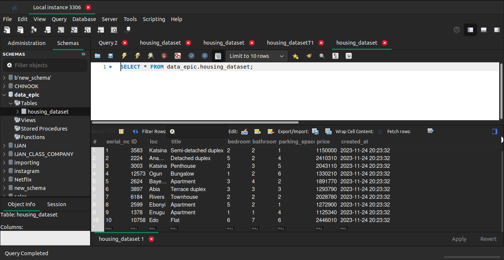

# DATABASE INGESTION

This project involves ingesting data into a MySQL database. Its uses gspread library to load data from google sheets into a pandas dataframe. The loaded data is then ingested into a mysql database using mysql connector.

## Data Source
The data source is from a Nigerian Housing Dataset loaded into google sheets which can be found [here](https://docs.google.com/spreadsheets/d/1scjNSIhgbQknwOEMs_sa9AyQZVxz1kAcoFFoxKq-DMY/edit#gid=552750787)

## Technology Stack
- Python
- MySQL
- Poetry

## Getting Started

### Install poetry
``` curl -sSL https://install.python-poetry.org | python3 -```

confirm that poetry has succesully installed by running `poetry --version`

run `poetry config virtualenvs.in-project true` to set poetry to create virtualenv in project folder

### Setup MySql
To setup MySql on different os, checkout the instructions 

- [windows](https://www.freecodecamp.org/news/how-to-install-mysql-workbench-on-windows/)
- [linux](https://phoenixnap.com/kb/mysql-workbench-ubuntu)
- [macos](https://www.geeksforgeeks.org/how-to-install-mysql-workbench-on-macos/)

### Clone Project
clone project using the following command

```git clone https://github.com/Data-Epic/Shadow-Ops.git```

change directory into the `project_5` folder using `cd Shadow-Ops/project_5`

configure environment variables
use `.env.example` to configure `.env` to store environment variables

``` bash
poetry config virtualenvs.in-project true
poetry install
poetry run app
```

## Outputs

